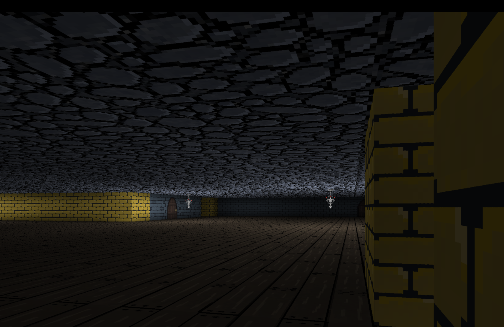
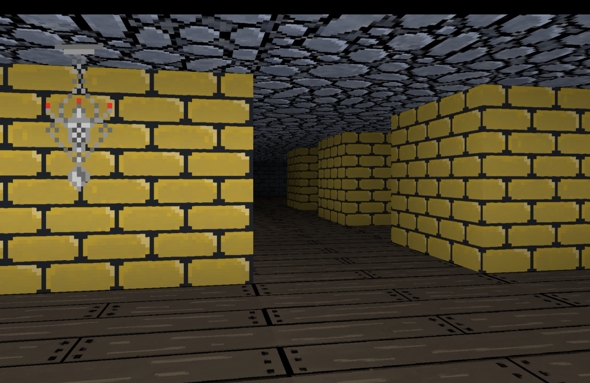

# C Raycaster

A raycaster written in C, using flecs. Originally intended as a
small side project just to learn C and flecs, but then saw this
[great video](https://www.youtube.com/watch?v=JgfACGvWiM4)
demonstrating amazing looking smooth lighting
and thought I'd have a whack at getting that working in
a raycaster myself.







## Dependencies

- [SDL3](https://github.com/libsdl-org/SDL)
- [flecs](https://github.com/SanderMertens/flecs)
- [glib](https://gitlab.gnome.org/GNOME/glib)
- [cJSON](https://github.com/DaveGamble/cJSON)

All dependencies are managed via [Conan](https://conan.io).

## How to build

### Windows

Download dependencies with Conan:
```sh
conan install . --build=missing
```

Configure with cmake:
```sh
cmake --preset conan-default
```

Build:
```sh
cmake --build build --config Release
```

Run the binary:
```sh
build\Release\raycaster.exe
```

### MacOS

Download dependencies with Conan:
```sh
conan install . --build=missing
```

Configure with cmake:
```sh
cmake --preset conan-release
```

Build:
```sh
cmake --build build/Release
```

Run the binary:
```sh
build/Release/raycaster
```

## Configuration

Settings are loaded from `config.json` in the working directory at startup. The file has three top-level sections:

### `video`

| Option | Type | Description |
|--------|------|-------------|
| `resolution.width` | integer | Screen width in pixels |
| `resolution.height` | integer | Screen height in pixels |
| `fps_cap` | integer | Target frames per second |
| `enable_lighting` | boolean | Enable or disable dynamic lighting |
> **Note:** `enable_lighting` currently does nothing.

### `textures`

Maps integer IDs to PNG file paths. These IDs correspond to values in the `world_map[]` array (for walls, floors, and ceilings) or to `sprite_id` fields on entities.
> **Note:** Currently all floors and ceilings are hardcoded to the ID value "1". The world map layout is hardcoded in src/map.c, so the `world_map[]` array will have to be modified to change the map layout. The light sources are also hardcoded in src/lighting.c. Ideally in the future this would all be changed to pull from a file instead of having hardcoded values.

```json
"textures": {
  "walls":    { "1": "assets/Stone_Brick.png" },
  "ceilings": { "1": "assets/Stoney_Wall.png" },
  "floors":   { "1": "assets/Floor_Boards.png" },
  "sprites":  { "1": "assets/Incense_Burner.png" }
}
```

### `entities`

An array of sprite entities placed in the world:

```json
{
  "tag": "torch",
  "position": { "x": 3.5, "y": 2.5 },
  "sprite_id": 1
}
```

| Field | Type | Description |
|-------|------|-------------|
| `tag` | string | Name used as the ECS entity identifier |
| `position.x` | float | X position in world coordinates |
| `position.y` | float | Y position in world coordinates |
| `sprite_id` | integer | References a key in the `textures.sprites` map |

### Example

```json
{
  "video": {
    "resolution": { "width": 1920, "height": 1080 },
    "fps_cap": 60,
    "enable_lighting": true
  },
  "textures": {
    "walls": {
      "1": "assets/Stone_Brick.png",
      "2": "assets/Stone_Brick_2.png"
    },
    "ceilings": { "1": "assets/Stoney_Wall.png" },
    "floors":   { "1": "assets/Floor_Boards.png" },
    "sprites":  { "1": "assets/Incense_Burner.png" }
  },
  "entities": [
    {
      "tag": "torch",
      "position": { "x": 3.5, "y": 2.5 },
      "sprite_id": 1
    }
  ]
}
```

> **Note:** The config file is required, there are no fallback defaults. If the file is missing or malformed the application will crash.

## Controls

| Key | Action |
|-----|--------|
| W | Move forward |
| A | Rotate left |
| S | Move backward |
| D | Rotate right |
| Q | Look up |
| E | Look down |

## Sources

- Made using [Lodev's raycasting tutorial](https://lodev.org/cgtutor/raycasting.html)
- Hash table implementation based on [Hash Table in C](https://benhoyt.com/writings/hash-table-in-c/) by Ben Hoyt
- Lighting implementation referenced from [miguelggcc's raycaster](https://github.com/miguelggcc/raycaster/tree/master)
- Camera pitch enhancements based on [lodev-enhance](https://github.com/wernsey/lodev-enhance/tree/90cf66b815848976438c802ea74a2d39b651a1be) by wernsey

## License

Feel free to use this for whatever — commercial, personal, educational. Do what you want with it.
